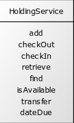
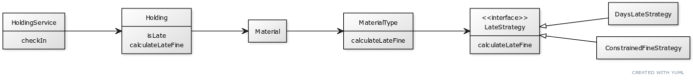

In chapter [x], you learned how to best organize code statements and expressions in the form of functions or methods. [[ READ ]]

Hopefully the most useful things you learned are:

* Functions provide a way to declare, invoke, and reuse pieces of logical behavior, or *concepts*.
* While nothing prevents you from aggregating multiple concepts into a single function, you're much better off if you compose methods that capture small, discrete concepts.

In this chapter, you'll hear echoes of the advice from chapter [x] at the next-up organizational construct: classes or modules.

## Classes and Modules vs. Files

Your programming language allows you to group concepts into a single construct--a *class*, if you're coding with an object-oriented language, or perhaps a *module* if you program in a primarily functional language like JavaScript, Elixir, or F#.

In some object-oriented languages, such as Java, a file can declare only a single, publicly available class. Other languages, such as C++, TypeScript, and Ruby, allow you to declare multiple classes within a single file.

To make matters more confusing, some languages (both OO and functional) allow you to declare *namespaces*. These can help you avoid name clashes across a larger system. They can also help you organize related concepts. For our purposes, consider that the primary use of a namespace is to group related concepts.

Most functional languages--for example, Clojure, Elixir, and Haskell--allow you to organize functions into multiple, separate modules within a file. Even for languages that don't directly support modules/namespaces within the language (JavaScript comes to mind), you can organize multiple "virtual" modules within a single source file.

Just because you can doesn't mean you should. *Generally*, stick to a single module or class per source file. You'll create fewer headaches for you and your dev team.

Everything is a tradeoff in software development, of course, and thus exceptions always exist. You might find it useful to declare other very closely-related classes within the same sourcefile, such as small structs (e.g. `record`s in Java) or exception types. Perhaps they are consumed only by other types within the same file, or they always appear in client code that also involves the file's primary type.

(All of this, of course, means little to those devious Smalltalk programmers, who have the audacity to not even use files when it comes to organizing code.)

But, yeah, for the most part: class <=> file, or module <=> file, or whatever. Consider the file part of things mostly not relevant in our discussions this chapter. We're going to focus instead on how to properly group `concepts` in classes and modules.

## What *Should* a Class Contain

You could conceivably lump together your system's entire set of methods into a single class&mdash;a monolith. You could, similarly perversely, create a separate class for each and every method. Both are outrageous ideas, though I've done the former for very small systems, and perhaps the second isn't so outrageous for some Smalltalkers.

Classes provide ways to help you keep your sanity as your system grows. Without sensible organization, you will:

* have a harder time finding the code you're looking for
* bloat your system with considerable redundancy; doubling it in size is easily in range
* create defects around inconsistent behaviors, due to the redundancies
* create defects due to increasing complexity (...)
* spend extensive amounts of time writing automated tests for it
* ...

All those outcomes increase in likelihood with growth, in turn increasing your costs and frustrations.

We'll talk about "clean class design" throughout this chapter. In your head, translate that to "doing all the things that should make our development lives easier."

"Clean" isn't a ding at anyone. Our notion of "unclean" is a way of characterizing code that demands more effort from the average developer to understand or maintain.

## Characterizing Class Design

The quality of a design can only truly be assessed in the face of change, change that occurs each time the system must take on new features. Is it getting increasingly costlier to introduce new features as the system grows and ages? Is the number of defects increasing? 

Across seven decades of software development, we've gathered empirical data from our  experiences with accommodating change. We've gleaned valuable insights from that data, and continually extrapolated those learnings into larger and newer contexts.

In the late 1940s, a typical system *was* implemented like our degenerate example, with the entire set of code essentially stored in a single function, to be read and executed top-to-bottom. Let's call this a monolith.

John von Neumann and Herman Goldstine's article, "Planning and Coding of Problems for an Electronic Computing Instrument" explored the premise of a subroutine: *"We call the coded sequence of a problem a routine, and one which is formed with the purpose of possible substitution into other routines, a **subroutine**."* The premise was that subroutines (particularly for smaller, common operations) would cut down on the amount of code by allowing re-use, and would also help reduce defects.

Pioneers Maurice Wilkes and David Wheeler were inspired by ideas found in the seminal article, and implemented the concept of subroutines in the EDSAC computer in 1951. In short, they believed that code modularization brought about by subroutines would lead to less costly software development. They didn't wait for research (though it did come, slowly, across later decades).

Since, we extrapolated the claimed value of modularization, originally brought about in the form of subroutines, to larger contexts. We learned to organize collections of subroutines&mdash;functions or methods&mdash;into modules or classes. That in turn presented new challenges around the composition of such modules and classes, as well as the interrelationships (dependencies) between them. We began to derive various heuristics to guide other developers.

## Heuristics and Characteristics

Heuristics help you identify the steps to take, and also the steps to avoid, to arrive at well-designed classes:

- **Positive heuristics**&mdash;steps to take. Kent Beck's four rules of emergent design[[ref]], for example, tell you to ensure that all code is testable as you go, to eliminate logical redundancies, to ensure all programmatic elements are clearly and concisely named, and to minimize overdesign.
- **Negative heuristics**&mdash;steps to avoid. Anti-patterns describe bad paths to take while developing code.

Characteristics help you assess the current quality of your classes.

- **Positive characteristics**&mdash;desired traits. Bob Martin's collection of five class design principles, known as SOLID, have withstood around three decades of scrutiny, and can be practically applied to functional code as well.
- **Negative characteristics**&mdash;undesired traits. Martin Fowler's code smells [ref] are a collection of things to avoid in code, each identified with a memorable name. *Shotgun surgery*, for example, indicates that your code demands that you frequently must update numerous classes in order to effect simple changes.

Characteristics and heuristics can describe design at both the method (micro) level and the class (macro) level (or even higher levels).

You might be able to consider some characteristics as heuristics, and vice versa. [ so what ] For much of this chapter, we'll focus on the *characteristics* of an ideally-sized class, because the idea is that you can glean them from looking at the code.

Such a class is typically small. Its name concisely summarizes the small numbers of behaviors gathered within. And it is defined cohesively [define]. As a result, the class exhibits the characteristic of adhering to the single-responsibility principle (SRP): It has one reason to change.

## When Is a Class Too Large?

Let's take a look at the HoldingService class, used to manage holdings--materials, such as books or physical records, held by a library system or its patrons. Here are the public behaviors defined on HoldingService:

```
boolean isAvailable(String barCode)
Holding find(String barCode)
String add(String sourceId, String branchId)
void transfer(String barcode, String branchScanCode)
Date dateDue(String barCode)
void checkOut(String patronId, String barCode, Date date)
int checkIn(String barCode, Date date, String branchScanCode)
```
Let's depict that HoldingService interface as a picture (because we'll be looking at more pictures later), using UML (Unified Modeling Language) diagramming guidelines:



The method parameters aren't usually interesting when we start looking at class level design. We'll omit them until they become useful.

Our picture shows that the HoldingService allows holdings to be added to the system, to be checked out or checked in, and transferred from one library location (*branch*) to another. The HoldingService also supports a few queries, including the ability to retrieve holding details, to answer whether it's available for a patron to borrow ("check out"), and to determine when the material must be returned.

The picture suggests that the core (single?) responsibility of the HoldingService is to manage the disposition of holdings. Each of the behaviors depicted directly supports that interest.

The Single Responsibility Principle (SRP) tells us to be a bit more picky, however: An SRP-compliant class should have only one reason to change. It's the opposite of a monolith, in which every single change requires updating the sole class in the system.

Why might a single-responsibility class be desirable?

* Its name can concisely reflect the behaviors contained within, making those behaviors easier to locate
* It creates real possibilities for re-use
* Its likelihood of adhering to  and thus being closed to future changes increases (see the open-closed principle&mdash;OCP)
* It's easier to test 
* It makes your system more flexible
* ... 

Each of the behaviors in HoldingService implements a *policy*--a set of rules established by the library system and implemented in the code. The `dateDue` policy, for example, specifies that books are due 21 days after they are checked out and that DVDs are due 7 days after checkout.

The `checkIn` policy is more involved: When a book is returned ("checked in"), it is marked as available for other patrons to check out. The patron returning the book is assessed a fine for late returns, i.e. when a material is returned after its due date. The fine amount varies depending on the material type and other possible factors.

Policies do change, and it's possible that the policy for check-outs might need to change exclusively from the policy for check-ins. Such independent variance suggests implementing each of the policies in its own class&mdash;CheckOutService, CheckInService, etc.&mdash;at least if you want to be SRP compliant. At that point, the only job of the HoldingService would be as a consolidated interface for holdings interests that delegated to other objects to do the work.

ASIDE: Creating new classes is surprisingly easy in an IDE, yet we often resist as developers. While we probably don't want the "ravioli" system where *every* class contains only one method, there's nothing wrong with tiny classes containing three, two, or one method.

[ reword ] While the SRP tells us to be picky, it also doesn't tell us to speculate about the nexus of change. Your systems probably rampantly violate the SRP. Rather than go find code to change, wait for the next demand for change and ensure you take that opportunity to shape your system to be more compliant.

**principle: Design flows from need.**

## Code Policies ?

For now, let's assume that the core library policies for check-in and check-out are stable. When change occurs, we'll deal with it&mdash;see [ref later in this chapter]. 

It's easy to think of multiple reasons for the as-defined HoldingService to potentially change. For example, the library now wants patrons to rent DVDs for a longer period&mfash;14 days instead of 7&mdash;because they're an older technology and in low demand nowadays. But is that a problem for HoldingService as currently implemented?

While looking at sketches can be very helpful, we can't spot all change reasons by looking at UML alone. 

The interface of a class only tells you about the behaviors it directly publicizes. To understand fully the extent to which a class violates the SRP, you have to open up the source file and peruse the code. It doesn't take long to spot more reasons why a class might need to change.

Here's the `dateDue` method:

```
public Date dateDue(String barCode) {
   var holding = find(barCode);
   if (holding == null)
      throw new HoldingNotFoundException();
   return holding.dateDue();
}
```

Ahh, very nice. The service delegates responsibility to the Holding class, where its `dateDue` method presumably covers all the calculation details. The Holding class (or perhaps another class it depends on) absorbs such changes. The HoldingService class is isolated from them.

"Managing date dues" at all is a responsibility that could disappear (some libraries have done it). If and when that occurs, we'll look to shield HoldingService from similar, subsequent changes.

## Where Reasons to Change Hide

[intro sentence]
The HoldingService method `checkIn` does a pretty good job of declaring the policy for returning materials:

[v1]
```
public int checkIn(String barCode, Date date, String branchScanCode) {
   var branch = new BranchService().find(branchScanCode);
   var holding = find(barCode);
   if (holding == null)
      throw new HoldingNotFoundException();

   holding.checkIn(date, branch);

   var foundPatron = findPatronWith(holding);
   removeBookFromPatron(foundPatron, holding);

   if (holding.dateLastCheckedIn().after(holding.dateDue())) { // is it late?
      foundPatron.addFine(calculateLateFine(holding));
      return holding.daysLate();
   }
   return 0;
}
```

The `checkIn` method still begs a bit of cleanup. One line of glaring implementation detail stands out as a potential problem&mdash;the `if` statement that determines whether the check-in is late:

```
if (holding.dateLastCheckedIn().after(holding.dateDue())) { // is it late?
```

That conditional represents a policy decision: A holding is late if it's returned after the date due.

However, it's possible that the policy is considerably more complex. Librarians might imagine no end of new policy changes: VIPs (very important patrons) might be exempt from fines, they might allow grace periods, and so on. As a result, that seemingly innocuous single line of code adds another reason for HoldingService to change.

Because it exposes implementation detail, the conditional also slows code comprehension time. The detail demands closer inspection: We must carefully read it, then mentally assemble it into a singular concept.

A comment might help, but it's not the right solution, and can be a lie anyway. It's best if we can scan the code itself without the need to look elsewhere at comments&mdash;the distracting footnotes of code.

### Fixing the Problem

The right way to fix the problem involves moving the specifics of "is it late" out of the HoldingService class. Where to? We could move it to a new class such as LateHoldingService, but the obvious short-term candidate appears to be the Holding class.

Step one, however, is to abstract the concept of "is it late" to its own method. Yep&mdash;this notion of *extracting methods* should be familiar from the chapter on functions.

[v2]
```
public int checkIn(String barCode, Date date, String branchScanCode) {
   // ...
   if (isLate(holding)) {
      foundPatron.addFine(calculateLateFine(holding));
      return holding.daysLate();
   }
   return 0;
}

private boolean isLate(Holding holding) {
   return holding.dateLastCheckedIn().after(holding.dateDue());
}
```

The silly line-level comment "is it late?" has disappeared. The new query method's name, `isLate`, precisely imparts the same information. The implementation detail is encapsulated within.

Going forward, if you feel you need a comment to guide readers through a line or five of related code, consider extracting it into its own method. The "guiding" comment often provides the basis for the method name, as it does here. A clear, concise method name obviates the need for a comment.

Once isolated, the `isLate` method reveals a glaring code smell known as *feature envy*: The method, apparently envious of the `Holding` class, asks it multiple questions ("What's the date checked in? What's the date due?") in order to compute a result. It also shows disinterest in the HoldingService class on which it's defined. We can soothe the method's envy by moving it to the Holding class, where it can talk directly to its new peers:

[v3]
```
public class HoldingService {
// ...
   public int checkIn(String barCode, Date date, String branchScanCode) {
      // ...
      if (holding.isLate()) {
         foundPatron.addFine(calculateLateFine(holding));
         return holding.daysLate();
      }
      return 0;
   }
}

public class Holding {
   // ...
   public boolean isLate() {
      return dateLastCheckedIn().after(dateDue());
   }
}
```

The calling code now concisely states a piece of the overall policy:

```
if (holding.isLate())
```

The conditional is now immediately digestible. It doesn't require us to stop and pause. Instead, it helps us quickly understand the method's control flow, which in turn helps us know where we need to look next.

After moving the `checkIn` method to Holding, we look again at the method in its new context. Does the Holding class now contain too many reasons to change? Should we move the method again, perhaps this time to a brand-new class? What can be simplified within the method itself?

With every change, we continue to ask these kinds of questions as part of continuous design.

It might seem like we just passed the buck by moving a problem from HoldingService into Holding. But toward our primary interest in SRP compliant classes, we've removed one reason to change from HoldingService. We've also replaced unnecessary detail with an abstraction, which ni turn helps us more easily consider the remainder of HoldingService.

## An Overly-Open Implementation

Opportunities to extract and move are rampant in a typical codebase. Extracting implementation detail from a method often makes it obvious that the code belongs elsewhere. Do this enough and eventually most code makes it to the right place, and each "place" is a reasonably small, cohesive, and easy to work with.

Another line in the `checkIn` method similarly suggests feature envy:

```
foundPatron.addFine(calculateLateFine(holding));
```

We're calling a local method, `calculateFine`, that interacts with code defined in Holding, again asking it questions in order to calculate a fine. We move the method into Holding (with only two keystrokes in IDEA!):

```
foundPatron.addFine(holding.calculateLateFine());
```

Here's what `calculateLateFine` looks like in its new home:

[v3]
```

public int calculateLateFine() {
   var daysLate = daysLate();
   var fineBasis = getMaterial().materialType().dailyFine();

   var fine = 0;
   switch (getMaterial().materialType()) {
      case BOOK, NEW_RELEASE_DVD:
         fine = fineBasis * daysLate;
         break;

      case AUDIO_CASSETTE, VINYL_RECORDING, MICRO_FICHE, AUDIO_CD, SOFTWARE_CD, DVD, BLU_RAY, VIDEO_CASSETTE:
         fine = Math.min(1000, 100 + fineBasis * daysLate);
         break;
   }
   return fine;
}
```

Ugh, a switch statement, and an old-school one at that&mdash;the kind where control flow can accidentally drip from one case to the next if you're careless.

Even after being moved to Holding, the method still doesn't look at home. While `calculateLateFine` does interact directly with the Holding (asking it for `daysLate`), it predominantly interacts with the Material object returned by `getMaterial`.

`calculateLateFine` is the sort of method that will likely suffer many changes over time. It has at least three reasons to change: the addition of new material types (e-books, puzzles, STEM kits, and so on), new schemes to encourage patrons to return materials in high demand, and new rates to cover material price increases. 

Such a method violates another SOLID principle&mdash;we want to minimize "opening up" existing classes to make changes, and instead find ways to enhance a system by adding new, single-purpose classes. This is known as the *Open-Closed Principle*, or OCP.

Open classes introduce risk and cost. Holding is mos' def open. Changes to any of the three responsibilities in `calculateLateFine` carries the risk of breaking existing behaviors in Holding. With a drippy `switch` statement in the mix, anything can happen.

## Should We Do Anything Now?

Typical systems being what they are, we already missed most of the opportunities to take advantage of the OCP. Our codebase is unashamed about its openness. Virtually no classes are closed. Rampant change greets everyone who much touch the code. 

If change is a given, the best approach is to wait for it. Speculative cleanup introduces unnecessary risk from improvements no one yet needs. Let's wait for the next change.

## What About Now?

OK that didn't take too long. We were told, moments ago (between the prior paragraph and this section), that indeed we must support a couple new material types. Specifically, we need to allow jigsaw puzzles and board games to be borrowed. They'll fall under new fine scheme the library folks want to try.

We'll prepare for the new requirement by first factoring the code so that the change has minimal impact.

Each of the two switch branches calculates an appropriate `fine` value using one of two strategies. We can extract the tiny bits of calculation logic to a couple strategy classes, each implementing a command interface:

[v4]
```
public interface LateStrategy {
   int calculateFine(int fineBasis, int daysLate);
}
```

```
public class ConstrainedFineStrategy implements LateStrategy{
   @Override
   public int calculateFine(int fineBasis, int daysLate) {
      return Math.min(1000, 100 + fineBasis * daysLate);
   }
}
```

```
public class DaysLateStrategy implements LateStrategy {
   @Override
   public int calculateFine(int fineBasis, int daysLate) {
      return fineBasis * daysLate;
   }
}
```

Such tiny little classes!

Here's the updated `calculateLateFine` method.

```
public int calculateLateFine() {
   var daysLate = daysLate();
   var fineBasis = getMaterial().materialType().dailyFine();

   var fine = 0;
   switch (getMaterial().materialType()) {
      case BOOK, NEW_RELEASE_DVD:
         fine = new DaysLateStrategy().calculateFine(fineBasis, daysLate);
         break;

      case AUDIO_CASSETTE, VINYL_RECORDING, MICRO_FICHE, AUDIO_CD, SOFTWARE_CD, DVD, BLU_RAY, VIDEO_CASSETTE:
         fine = new ConstrainedFineStrategy().calculateFine(fineBasis, daysLate);
         break;
   }
   return fine;
}
```

Note that `calculateLateFine` first retrieves the material type (e.g. `BOOK`) from the material, in order to decide which strategy to apply.

Here's what MaterialType looks like:

[v4]
```
public enum MaterialType {
   BOOK(21, 10),
   AUDIO_CASSETTE(14, 10),
   VINYL_RECORDING(14, 10),
   MICRO_FICHE(7, 200),
   AUDIO_CD(7, 100),
   SOFTWARE_CD(7, 500),
   DVD(3, 100),
   NEW_RELEASE_DVD(1, 200),
   BLU_RAY(3, 200),
   VIDEO_CASSETTE(7, 10);

   private final int checkoutPeriod;
   private final int dailyFine;

   MaterialType(int checkoutPeriod, int dailyFine) {
      this.checkoutPeriod = checkoutPeriod;
      this.dailyFine = dailyFine;
   }

   public int dailyFine() {
      return dailyFine;
   }

   public int checkoutPeriod() {
      return checkoutPeriod;
   }
}
```

If each material type can be initialized with the checkout period and late fine amounts, it can also be initialized with a strategy object:

[v5]
```
import domain.core.ConstrainedFineStrategy;
import domain.core.DaysLateStrategy;
import domain.core.LateStrategy;

public enum MaterialType {
   BOOK(21, 10, new DaysLateStrategy()),
   AUDIO_CASSETTE(14, 10, new ConstrainedFineStrategy()),
   VINYL_RECORDING(14, 10, new ConstrainedFineStrategy()),
   MICRO_FICHE(7, 200, new ConstrainedFineStrategy()),
   AUDIO_CD(7, 100, new ConstrainedFineStrategy()),
   SOFTWARE_CD(7, 500, new ConstrainedFineStrategy()),
   DVD(3, 100, new ConstrainedFineStrategy()),
   NEW_RELEASE_DVD(1, 200, new DaysLateStrategy()),
   BLU_RAY(3, 200, new ConstrainedFineStrategy()),
   VIDEO_CASSETTE(7, 10, new ConstrainedFineStrategy());

   private final int checkoutPeriod;
   private final int dailyFine;
   private final LateStrategy lateStrategy;

   MaterialType(int checkoutPeriod, int dailyFine, LateStrategy lateStrategy) {
      this.checkoutPeriod = checkoutPeriod;
      this.dailyFine = dailyFine;
      this.lateStrategy = lateStrategy;
   }
   // ...
}
```

(Yes we could use singletons for each LateStrategy derivative, particularly since the subclasses contain no data. We could also specify a class type for each enum value, then use reflection to instantiate the strategy object. But why make things more complicated?)

MaterialType can then supply a `calculateFine` implementation that delegates to the `lateStrategy` object:

```
public int calculateFine(int daysLate) {
   return lateStrategy.calculateFine(dailyFine, daysLate);
}
```

The best part? At this point, the Holding method can simplify to a few lines of code to a single line of code that delegates to MaterialType:

```
public int calculateLateFine() {
   return getMaterial().materialType().calculateFine(daysLate());
}
```

Here's a picture of the updated solution:



[TODO: draw the UML in something that allows more control over layout; yUML doesn't appear to]

## Adding the New Feature (TODO)

[this will be a quick code section that demonstrates adding support for checkout out jigsaw puzzles and such. New fine policy will be a bit bizarre for humor purposes]

## Closed, Cohesive, Single-Responsibility Classes

### When Policies Change

Many service classes must orchestrate numerous disparate behaviors. They interact with business logic regarding various domains (holdings, patrons, branches), they might persist or retrieve data, and they might interact with external services. The HoldingServiceClass is one example of an orchestrating class.

Some services might have minimal orchestration needs. An example is a collection of behaviors concerned with date calculations,

A well-defined SRP-compliant service, as such, should either:

* contain *only* orchestration logic that declares policy and delegates to other classes for implementation specifics
* contain only implementation specifics for related domain or utility behaviors

In other words, don't mix policy with implementation detail. Doing so is costlier to understand, navigate, and maintain. It's also not SRP compliant: a policy change is one reason to make a code change, and implementation details about a step in the policy is another reason.

### Is This Overengineering?

What would happen if we took the SRP and the OCP to the extreme?

Virtually everything in our system would be "plug &amp; play." In a service, we wouldn't have a single controller class with a half dozen routes; we'd create a separate class for each route. It would register itself (perhaps like a `@PostMapping` annotation accomplishes in Spring Boot). Its sole job would be to delegate requests to a similarly single-purpose service class (or to reject them as a result of validation, which is likewise implemented elsewhere). Each micro-service facet would either represent a policy&mdash;whereby all specifics are delegated to&mdash;or a chunk of code that accomplished a singular need.

And so on for each class down the line. Pretty much all conditionals would be implemented polymorphically, i.e. both branches implemented in separate classes, much like states in a state pattern. Each step in a policy (a workflow) would be implemented in a separate class as well.

Ridiculous? It may sound like it, but such a system would truly support the OCP, whereby all new behavior was accomplished by dropping a new class in place. All classes would be small and easily tested in isolation. You'd write tests for each new class and perhaps would update an end-to-end test. Otherwise you'd make no changes to the system.

Almost all systems don't look like this, and they are harder to work with as well as riskier. They are initially more challenging for developers not familiar with the idea.

It's not a new idea, however&mdash;we worked with systems approaching this ideal thirty years ago in Smalltalk. Most classes were small, and the majority of methods were 1-3 lines of code each. Life was bliss.

As with most principles, consider both the SRP and the OCP as ideals: You want to always move in their direction, not away from them. It might be ok that you'll never hit the ideal. The typical system, however, does the opposite, and that's why it's harder to work with it as it grows.

Seek to create smaller, single-purpose classes. They're easier to work with (test, understand, change), and easier to close.

Seek to close classes. They're something you can consider "out of sight, out of mind." The goal is to have less code that you must concern yourself with.

### Simpler Testing

You could choose to retain whatever tests you had in place for HoldingService. When adding the new behavior for fines, you'd add to these tests. That's one acceptable route.

However, you can also distribute the testing as well. Yes, the individual fine policies aren't publicly exposed to the ultimate client, and might be considered "private behavior." But the policies are also isolated, closed concepts that can be reused&mdash;and more easily tested than within the larger context of HoldingService. They are also public in the sense that they could conceivably be consumed by a different client. Without focused unit tests, this wouldn't be possible.


We avoid testing implementation details. We test the outcomes of (small) behavioral concepts instead. Small closed units should be concepts that can be moved about and work in any context where they're useful. A days-late fine policy can be tested in isolation without exposing any implementation specifics. It is a "sub-behavioral unit."

Corollary: If you extract to a small, single purpose class, but don't view it as at all useful in any other possible context, don't make it publicly accessible. You'll still need to write tests that indirectly involve these classes at a higher, useful-publicly level. Test such private details only as a last resort.

---


A class always has two facets: an interface that declares the behaviors it supports, and a set of implementation specifics that provide the logic for those behaviors. Some languages, like Java or C#, provide direct means to declare the interface separately as a purely abstract concept. Regardless, the idea exists ... xxx

The abstract concept of an interface--a set of functions and the arguments required for each--still always has two reasons to change: It needs to support or stop supporting behaviors, or how clients interfaces with those behaviors (function arguments and return values) changes.

The interface segregation principle (ISP) states that "a client should not be forced to implement interfaces it does not use." That's stating a principle in terms of the potential negative impact if ignored--a changing interface requires clients to expend effort to accommodate the change (minimally, by ensuring none of their interests have broken). But another way to look at the ISP is that it's a restatement of the SRP: An interface should have one reason to change.


The simple answer is: delegate! If a behavior has any real complexity, consider moving it into another class.

An ideally-defined SRP compliant class should be an entry point into a series of behaviors, each delegating to another class that implements the gory details.


## Enter AI

The age of AI takes us to the point where it now becomes obvious how we are advancing by orders of magnitude every 7 years or so. Today, we can ask an LLM to produce code at the class level, and it will do an ok job, maybe getting 80% of the code correct. (Here's that good old 80/20 rule again.) We can get it to a better job by:

* providing it with examples
* providing it with a simple style that tells it to:
  a) produce small, single-purpose modules/classes and small, single-purpose functions/methods
  b) produce more-functional solutions with less state management and side effects
  c) emphasize clarity

What's cool is that this simple style matches how we've been told to code all along. It's also the style that has the most robust amount of effort behind its derivation.[meh, writing] We have concepts like SOLID and an exhaustively-examined body of work in design patterns; these things have been around for decades now.

### It Will Be Wrong

Unfortunately, we cannot trust that an LLM will get 100% of the code correct. The easy solution is to have it generate tests from the examples provide, then vet the tests for fidelity with our examples, then run them.[reference to AADV here]

In fact, *comprehensive testing for behavioral intent is **essential** when using AI*. AI will quickly generate more code than has been produced by humans to this point in history. It should create fear in everyone that 20% of that code is likely to be defective.

When the AI gets the code wrong&mdash;it will&mdash;we need to have a conversation with it. That conversation is far more effective with a clean design: The source of the problem will be easier to pinpoint, and the resolution can involve focusing on that one small class or method. (If it's a method, sometimes the best route is to have the AI extract what's know as a "method object"&mdash;a new class that embodies the single troubled method. [reference Feathers WELC here])

While the current trend is to view AI as most-useful as a line-by-line coding assistant, it's already at the point where it's more effective to have it produce code at a modular level. At this point, the code content of the module matters far less. Need to change a class? Pull up the list of examples, update them, and regenerate both the tests and production code. That's not so easy if the modules aren't SRP-compliant.

Don't get us wrong. We love mucking with code on a line-by-line basis. We are gratified by streamlining functions to make them elegant (clear and concise). But ultimately, the contents of any well-composed function is irrelevant once we begin generating wholesale modules.

Our focus begins to shift. We concern ourselves with the overall architecture/design of the system, and we seek to create a system based on the OCP and SRP. When we need new behavior, we generate the appropriate module using AI, we vet the tests it generates, and drop it into place.

Our system designs once again take center stage. We find value in employing time-honored design patterns that directly speak toward pluggable designs: functional pipeline, command, factory, decorator, strategy, composite, chain of responsibility, and bridge.

ALl this is great for the near future. At some point (5 to 15 years out?), AI will be able to can completely implement an entire system from a set of examples/tests. We'll be happy to have retired by then.


# Cruft (ignore me for now)

A bunch of stuff that flowed out. Some pieces might fit somewhere.

## Integration vs Unit Testing

The debate about integration testing vs. "unit" testing continues to rage on. It's not really an either-or choice&mdash;both have their place.

We like having tons of tests that verify small behaviors ("units"), because they're easy to write, maintain, and provide very fast feedback. But they're insufficient. We need to also verify that end-to-end functionality works, and that configurable things actually work. It's dumb, for example, to try to verify that CORS code works without making actual HTTP calls.

We like having integration tests. They're not usually as easy to write, usually much harder to maintain, and provide slower feedback. As such, they're not the best choice when it comes to verifying the nuances of small little computational variances (how does the system handle nulls, for example, and how do we blast through verifying the dozens of validations we likely have on a given set of inputs). But integration tests cover concerns that unit tests cannot, and are essential for having the confidence to deploy to production.
[ end aside? ]

[ odd thought ]
(Never mind that measuring some of these characteristics might be near impossible. How, for example, do you compare the size of one feature to another?)  [[ maybe reference Capers Jones, "Programming Productivity"? or something from Brooks, "no silver bullet"? ]])
[ end odd thought]

[ some history ]
Our programming history has seemed a pendulum: Early on, we got code to work, with little consideration for how it was structured. As systems grew in complexity and size, we realized that maintaining them was becoming increasingly expensive. In response, we introduced increasingly strict guidelines on how to structure code, plus increasingly heavy speculative planning about how that structure should be designed.

We went too far. [brief bit on waterfall / misunderstanding of Royce]

The pendulum swung back to a process that rejected the heavy-up-front speculation, whether around project planning or the system's needs and design. [describe agile origination briefly here]

The outcome of the meetings-of-minds was the consensus named "agile software development." It was the lowest-common denominator that the minds could agree upon. Unfortunately, there was apparently little LCD for the topic of how to address design in a software project.

Never mind that there was still value in considering design throughout a project. XP, for example, taught us how to incrementally and iteratively produce a quality design by employing quality controls like TDD and pair programming. Such controls continue to help us safely address continuous changes to design.

Still, agile never rejected all the useful things we'd learned about design to that point. Wiser teams knew that poor design slowed things down, and maintained a high level of awareness about the system's current design. They even continued to draw quick UML sketches to help streamline design discussions. What they didn't do was invest copious up-front effort in a speculative design and consider it complete.

The pendulum started falling off the hook, unfortunately, around the end of the first decade of the new millenium. As demand for programmers grew rapidly, web searches and the need for quick answers overtook principled, conceptual, and comprehensive learning. Dramatically increasing numbers of developers read less and knew less, particularly about design (a much harder topic to learn than, say, the new cool Javascript framework of the week).

We were also betrayed by the fact that agile seemingly de-emphasized design. (It didn't. Read the dozen principles behind the agile manifesto: https://agilemanifesto.org/principles. At least one principle directly states the importance of design: "Continuous attention to technical excellence and good design enhances agility." Other principles implicitly speak toward good design, and some aren't at all possible without it.) The one agile process that captured the most attention suggested that you should sprint and slap out software each month. But it never said anything from a technical perspective about how to do that successfully. (Notably, one of Scrum's proponents went so far as to suggest that all you had to do was throw a bunch of developers in a room, and that they were smart enough to figure all that stuff out.)

If anything, an iterative-incremental process will exacerbate the results of not heeding design. You'll create a steaming scrum-pile of unmaintainable software in 6 to 18 months, maybe sooner, if you ignore design as you sprint toward a solution.

It's not that Scrum's proponents said to ignore design, however. When pressed, they most certainly said that design is important, that Scrum's goal was to provide a project framework, and that you should learn quality design elsewhere.

Unfortunately, all this ended up being heard as "agile says we don't have to worry about design." In the last 15 years, teams have returned to off-the-cuff coding, with just about everybody for themselves deciding what a good design was. The things that stuck seemed to be least meaningful (if not entirely useless)&mdash;just about everyone knows that you *must* have curly braces around even a single-line block of code, even if they're fuzzy about why. Or fuzzy about how a test-driven approach might make that ABSOLUTE RULE OF PROGRAMMING moot. Cargo culting for the win!


## anti-anti-SOLID rant. Postmodernist nihilism

A few years back, it became chic to dismiss aforementioned time-tested design perspectives such as SOLID.

Some folks said things like "everything in SOLID is wrong." [ref: North article] If this is correct, it's for but a small number of contexts and for a peculiar definition of "wrong."

Another way to phrase this cynical take is to suggest that everything is wrong, it's just a matter of degree. All estimates are wrong, for example; it's just a matter of degree--weeks, days, minutes, hours, seconds. That doesn't mean, however, that estimates aren't useful in certain contexts.

The better mindset suggests that, most of the time, the principles we've learned will help you develop software more easily.

blah blah -- all accepted design perspectives (solid, code smells, simple design, ...) lead to the same outcome: clarity, conciseness, cohesiveness, and confirmability.


## Method Design vs. Class Design

We split method and class considerations into two chapters within Clean Code. The reality is that neither can be addressed in isolation. Your system's design is a careful balance of method and class (or function and module) implementation.


## References

[In Praise of Wilkes Wheeler and Gill](https://cacm.acm.org/opinion/in-praise-of-wilkes-wheeler-and-gill/)

Goldstine, H.G. and von Neumann, J. Planning and Coding of Problems for an Electronic Computing Instrument, 1947&mdash;1948.
https://www.ias.edu/sites/default/files/library/pdfs/ecp/planningcodingof0103inst.pdf

Wilkes, M.V., Wheeler, D.J., and Gill, S. The Preparation of Programs for an Electronic Digital Computer, Addison-Wesley, 1951.
